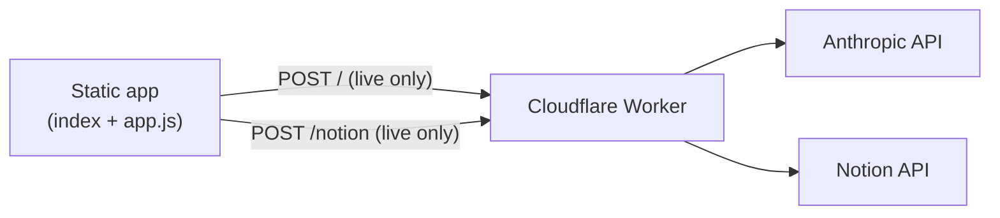

# Support ticket analyser

A four-step support workflow tool: paste a ticket, match internal documentation, draft a response, generate a KB article, and publish to Notion. Built as a portfolio project aligned with [madihaintech.me](https://madihaintech.me).

> **Local development:** A separate folder `support-dashboard-local` (sibling to this repo) holds your real worker/Notion config for full-stack testing. Do not publish that folder to GitHub.

## Live demo (portfolio mode)

When hosted on GitHub Pages (or opened as a local file), the app runs in **portfolio demo mode** by default:

| Step | Behaviour |
|------|-----------|
| 1–3 | **Real** — documentation matching, gap detection, related articles, response drafting (all in the browser) |
| 4 | **Simulated** — KB draft is generated locally from your ticket/response; “Publish” shows a success modal but **does not** call Claude or Notion |

A banner at the top explains this. **Do not paste real customer PII** into the public demo.

### URL flags

| URL | Mode |
|-----|------|
| Default on `*.github.io` | Demo |
| `?live=1` | Full stack (requires your worker URLs in `js/app.js`) |
| `?demo=1` | Force demo |
| `localhost` | Live by default (for local development) |

## Features

- Keyword-based documentation matching (80% strong-match threshold)
- Documentation gap flow with related articles (30–79% relevance) and expandable steps
- Editable KB draft: title, category, summary, troubleshooting steps, tags
- Download markdown from the current draft
- Notion publish via Cloudflare Worker (live mode only): database properties + page body blocks

## Project structure

```
support-dashboard/
├── index.html           # App shell
├── styles.css           # Styles
├── js/
│   ├── app.js           # Workflow, demo mode, API calls
│   └── documentation.js  # Sample KB catalogue (replace with your docs)
└── worker/
    ├── src/index.js     # Claude + Notion proxy
    ├── wrangler.toml    # Your deploy config (not committed with secrets)
    └── wrangler.toml.example
```

## Self-hosting (full live mode)

### 1. Frontend

Open `index.html` with a static server, or deploy to GitHub Pages / any static host.

Update `CONFIG` in `js/app.js`:

```javascript
proxyUrl: "https://YOUR-WORKER.workers.dev/",
notionPublishUrl: "https://YOUR-WORKER.workers.dev/notion",
notionFallbackUrl: "https://www.notion.so/", // optional fallback
```

Use `?live=1` on GitHub Pages, or run on `localhost` without `?demo=1`.

### 2. Cloudflare Worker

```bash
cd worker
npm install
cp wrangler.toml.example wrangler.toml   # if needed
# Edit wrangler.toml — set NOTION_DATABASE_ID
npx wrangler secret put ANTHROPIC_API_KEY
npx wrangler secret put NOTION_API_KEY
npx wrangler deploy
```

Create a Notion integration, share a **dedicated** database with it, and use that database ID in `wrangler.toml`.

### 3. Documentation catalogue

Edit `js/documentation.js` — each article needs `keywords`, `snippet`, `resolutionSteps`, and `issueTopic` for matching and suggested responses.

## Architecture



In **demo mode**, steps 1–3 stay entirely in the browser; step 4 is mocked in `app.js`.

## GitHub Pages

1. Push this repo to GitHub.
2. Settings → Pages → Deploy from branch `main`, folder `/` (root).
3. Your demo URL will be `https://<user>.github.io/<repo>/` — demo mode activates automatically.

Add screenshots or a short screen recording of a **real** publish (using `?live=1` and a sandbox Notion DB) to this README for reviewers.

## Privacy & security

- Never commit API keys or `.env` files.
- Use a **sandbox** Notion database for public demos, not production KB data.
- Rate-limit your worker if you expose `?live=1` publicly.

## Licence

MIT (or adjust as needed for your portfolio).
