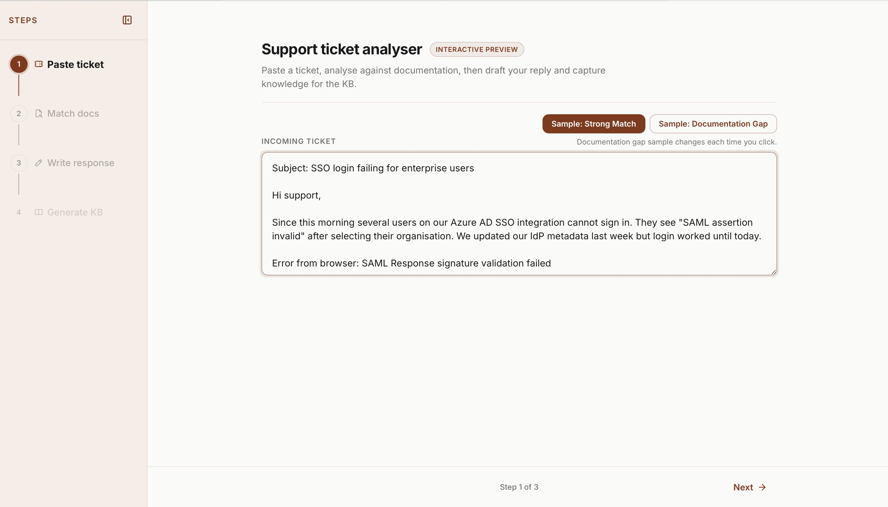
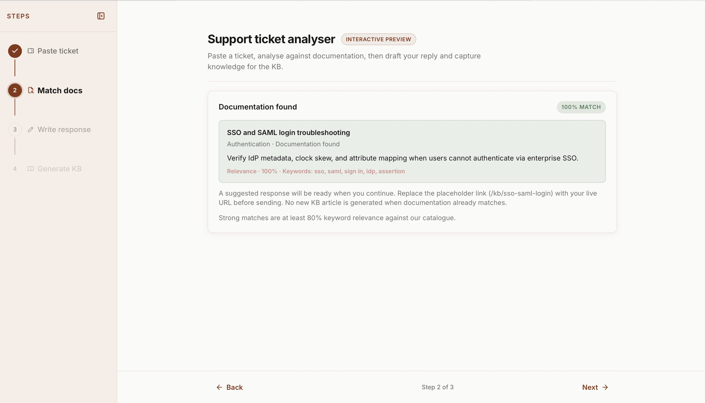
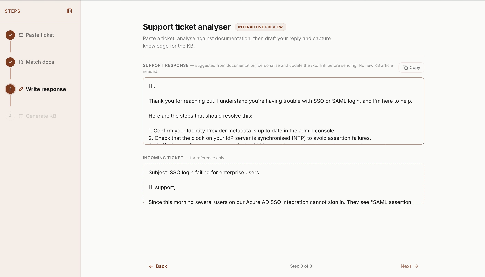
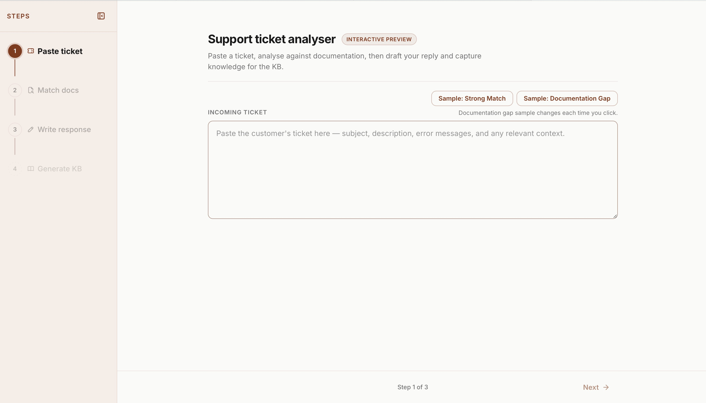
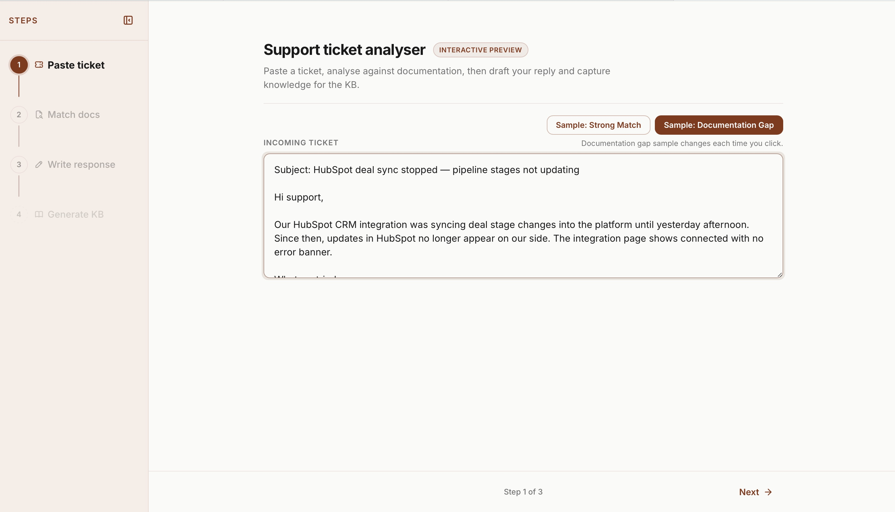
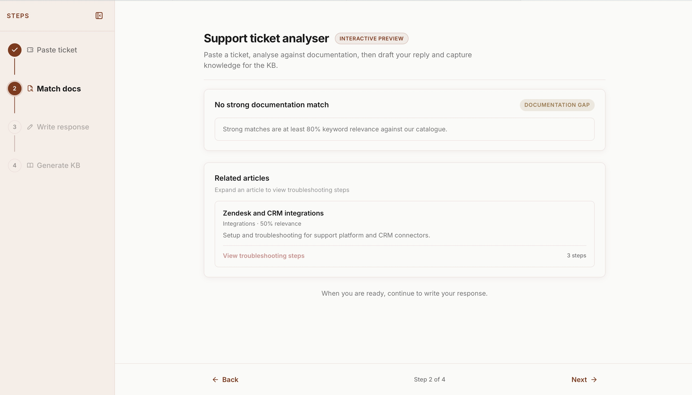
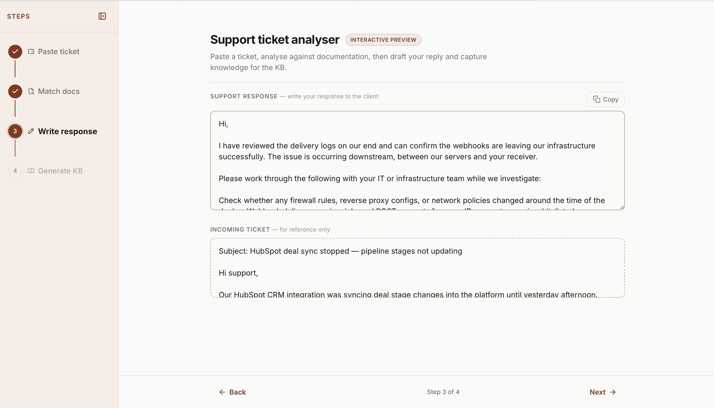
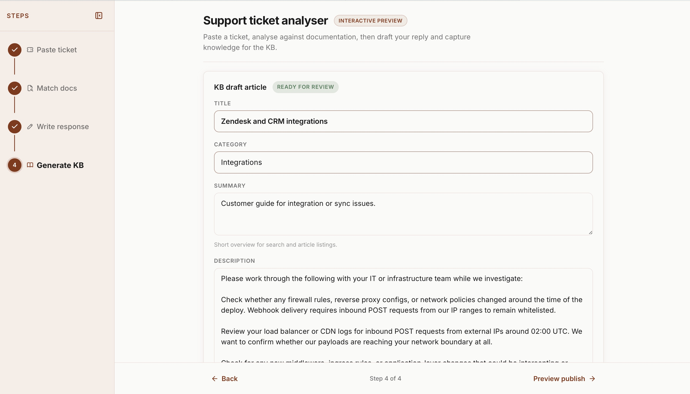
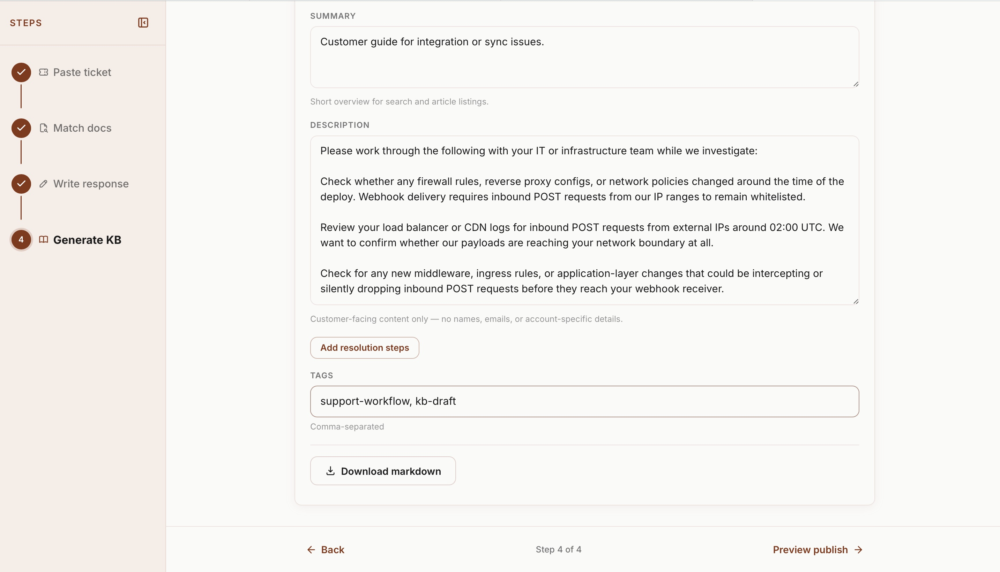
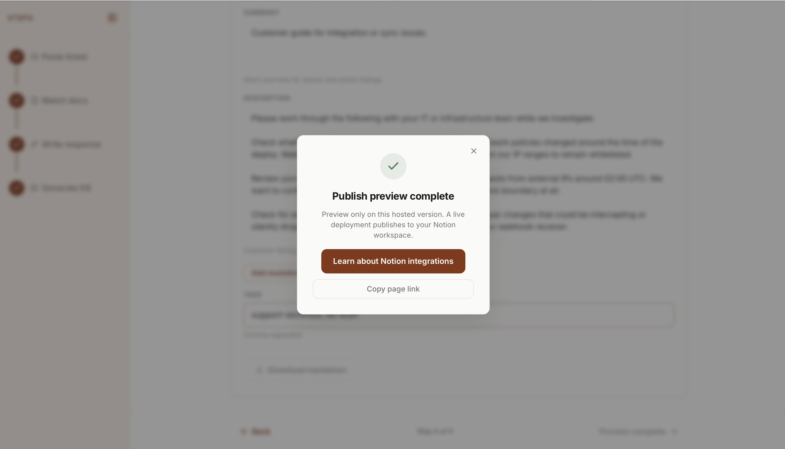

# Support Ticket Analyser

Most support teams resolve the same issues repeatedly because the knowledge never gets captured. A support engineer fixes the problem, sends the response, and moves on. No article gets written. The next engineer starts from scratch.

This tool changes that.

Paste a ticket and it checks whether documentation already exists. If it does, it drafts a response grounded in that article. If it does not, it flags the gap, helps draft a response, then generates a KB article ready to publish directly to Notion.

Built from scratch because this gap exists in every support team I have ever worked in.

**[Live demo](https://khankmadiha.github.io/support-ticket-analyser/)** · **[Case study](https://madihaintech.me/support-dashboard.html)** · **[Source](https://github.com/KhanKMadiha/support-ticket-analyser)**

---

## How it works

**Strong match (≥80% keyword relevance)**

Documentation already exists. The tool surfaces the matching article, shows which keywords fired, and pre-fills a suggested response grounded in documented resolution steps. Workflow ends at Step 3. No duplicate KB article is created.

**Documentation gap (<80%)**

No strong match found. The tool flags the gap explicitly, surfaces related articles at 30–79% relevance as interim context, and routes through to Step 4 to draft and publish a KB article so the same gap does not repeat.

The goal is not a faster reply. It is a repeatable loop that turns a resolved ticket into documented knowledge that benefits the whole team.

---

## Screenshots

### Strong match flow

**Step 1 — Strong match sample loaded**

**Step 2 — 100% match found with keywords visible**

**Step 3 — Response suggested from documentation. No KB article generated.**

---

### Documentation gap flow

**Step 1 — Empty state with sample buttons**

**Step 1 — Documentation gap sample loaded**

**Step 2 — Documentation gap detected**

**Step 3 — Draft response**

**Step 4 — KB article generated**

**Step 4 — Tags, resolution steps, and download**

**Publish preview complete**

---

## Why the matching is transparent

Step 2 uses a keyword relevance scorer so every match is explainable. You can see exactly which keywords fired, why a match was found, and what counts as a gap.

When you are telling an engineering team a documentation gap exists, you need to show your working. A black-box answer does not cut it.

---

## Demo vs live mode

The live demo runs entirely in the browser. No API keys required.

| Step | Demo | Live mode |
| ---- | ---- | --------- |
| 1–3 | Fully real | Same |
| 4 | KB draft generated locally, publish simulated | Claude drafts the article, Cloudflare Worker publishes to Notion |

To run in live mode, add `?live=1` to the URL and configure the Cloudflare Worker with your API keys. See `js/app.js` and `worker/` for setup details.

---

## Built with

Vanilla JavaScript · Anthropic Claude API · Cloudflare Workers · Notion API · GitHub Pages

---

## Licence

MIT
